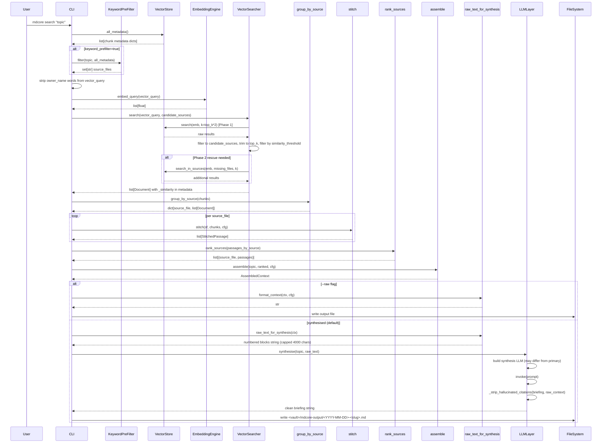
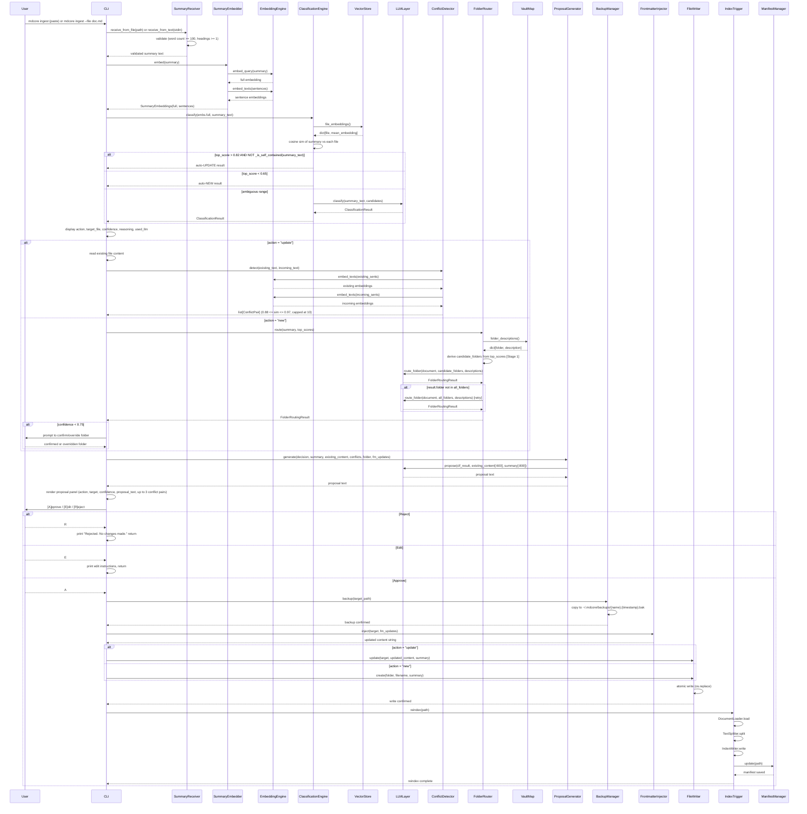
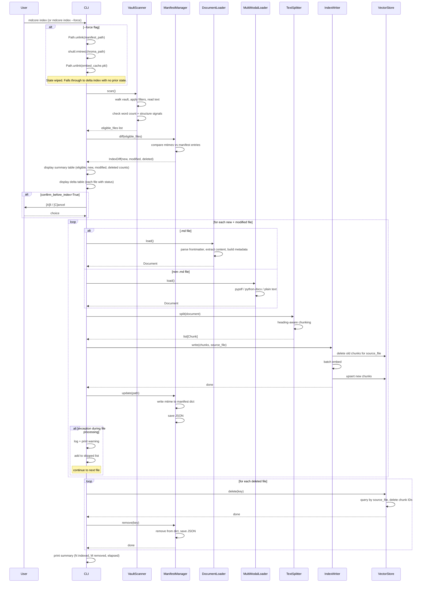
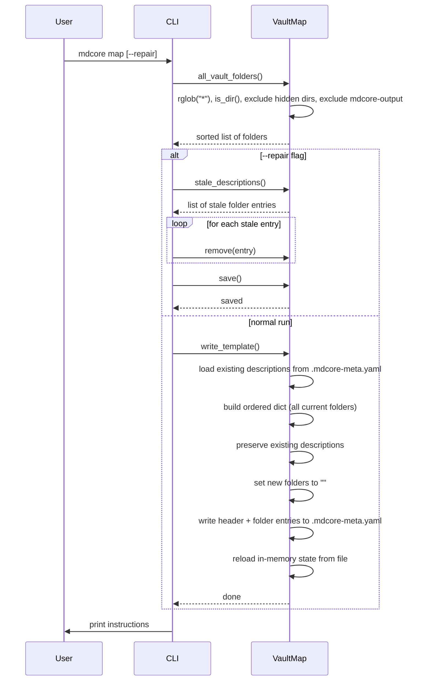
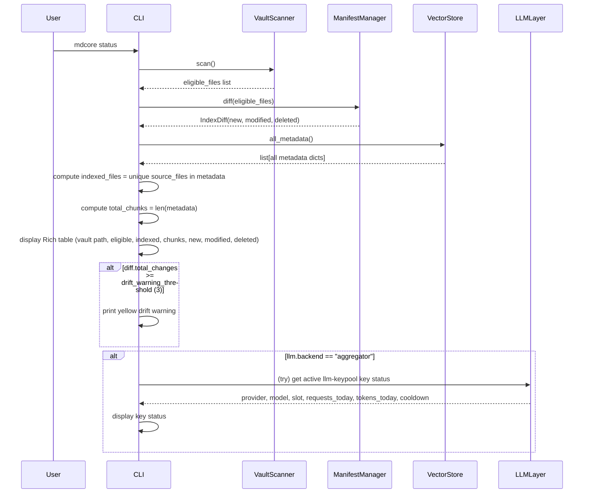

# mdcore Flow Reference

This document describes the four core runtime flows in mdcore (markdowncore-ai): search, ingest, index, and supporting utility flows (map, status). Each flow includes a Mermaid sequence diagram, a plain English walkthrough, failure mode analysis, and performance characteristics.

---

## Flow A: `mdcore search`

### Sequence Diagram



### Plain English Walkthrough

1. The user runs `mdcore search "topic"` from the command line.
2. The CLI fetches all chunk metadata from ChromaDB to build a candidate pool.
3. If `keyword_prefilter` is enabled in config, the `KeywordPreFilter` scans metadata for keyword matches and narrows the candidate source files before vector search. This reduces noise from unrelated documents.
4. The CLI strips any configured `owner_name` words from the query string before embedding, so personal name tokens do not distort the semantic vector.
5. The cleaned query is embedded by `EmbeddingEngine`, producing a float vector.
6. `VectorSearcher` runs a two-phase search:
   - Phase 1: fetch `top_k * 2` results from ChromaDB, then filter to candidates and trim to `top_k`, discarding anything below the `similarity_threshold`.
   - Phase 2 (rescue): if any candidate source files were missing from Phase 1 results, run a targeted `search_in_sources` call to recover them.
7. The result is a list of `Document` objects, each carrying a `_similarity` score in its metadata.
8. Chunks are grouped by source file, then stitched per source into `StitchedPassage` objects that respect heading boundaries and avoid mid-sentence cuts.
9. Passages are ranked across sources by `rank_sources`, which scores each source by its best chunk similarity and passage coherence.
10. `assemble` packs the ranked passages into an `AssembledContext` struct, applying any word budget limits from config.
11. In `--raw` mode: the context is formatted to a string and written directly to the output file. No LLM is called.
12. In synthesised mode (default): the context is serialised to a numbered block string (capped at 4000 characters to keep local model latency low), then passed to `LLMLayer.synthesise()`. The LLM layer builds its synthesis model (which can differ from the primary model), calls the LLM API, and strips any hallucinated citation numbers that do not appear in the raw context.
13. The final output file is written to `<vault>/mdcore-output/<YYYY-MM-DD>-<slug>.md`.

### Output File Format

**Synthesised mode:**
```markdown
# {topic}

*{timestamp} · {N} sources · synthesised by {model_name}*

> Verify claims against raw excerpts below.

## Sources

- [1] relative/path/to/file.md
- [2] other/file.md

---

## Briefing

{synthesis text with [1], [2] citations}

---

## Raw Excerpts

## Context package: {topic}
*Assembled by mdcore · N sources · M words · timestamp*

---

### [1] relative/path/to/file.md
*Sections: H2 Title > H3 Title*

{chunk text}

---
```

**Raw mode (`--raw`):** same structure but no Briefing section and no disclaimer. The mode label in the header reads "raw" instead of "synthesised by {model_name}".

### Failure Mode Analysis

| Failure | Behaviour |
|---|---|
| `ChromaDB.all_metadata()` fails | Exception propagates; user sees Python traceback |
| `ChromaDB.search()` fails | Exception propagates; user sees Python traceback |
| `EmbeddingEngine.embed_query()` fails | Exception from Ollama (not running) or API (timeout/quota); no retry; user sees exception |
| `LLMLayer.synthesise()` fails - no fallback configured | `RuntimeError("LLM call failed and no fallback configured. Error: ...")` |
| `LLMLayer.synthesise()` returns empty response | `RuntimeError("LLM returned an empty response. Ollama may be under load...")` |
| Filesystem write fails (output dir not writable) | Exception propagates |
| No results survive similarity threshold filtering | Yellow warning printed; exit 0; no output file written |

### Performance Characteristics

- **embed_query**: network call to Ollama or remote API. This is the first significant latency point (~100ms-2s depending on backend).
- **ChromaDB search**: in-memory HNSW index scan. Fast even for large vaults.
- **LLMLayer.synthesise**: the slowest step. Typically 5-30 seconds depending on model size and backend. Local Ollama models with large context are at the higher end.
- **embed_texts cache**: responses are cached in a dict keyed by text hash. Cache hits are instant. Misses trigger a batch embed call.
- **Parallelism**: none. Flow A is entirely sequential.
- **Synthesis prompt cap**: raw context is truncated to 4000 characters before being sent to the synthesis LLM, keeping local model latency predictable.

---

## Flow B: `mdcore ingest`

### Sequence Diagram



### Plain English Walkthrough

1. The user runs `mdcore ingest` (pasting content interactively) or `mdcore ingest --file doc.md` (pointing at a file).
2. `SummaryReceiver` reads the content and validates it: minimum 100 words and at least one heading. Invalid content raises immediately with a clear error.
3. `SummaryEmbedder` produces two kinds of embeddings: a single full-document vector and a set of per-sentence vectors. Both are used downstream for classification and conflict detection.
4. `ClassificationEngine` fetches the mean embedding for every indexed file from ChromaDB and computes cosine similarity between the incoming summary and each file. Three outcomes are possible:
   - **Auto-UPDATE**: similarity above 0.82 and the summary is not self-contained (judged by heuristics). No LLM call.
   - **Auto-NEW**: similarity below 0.65. No LLM call.
   - **Ambiguous** (0.65-0.82): the LLM is asked to classify. Candidates passed to the LLM use only the source file path as their `page_content`, not the actual document content, keeping the prompt compact.
5. The CLI displays the classification result: action, target file, confidence score, reasoning, and whether the LLM was consulted.
6. For **update** decisions: the CLI reads the existing file and runs `ConflictDetector`, which embeds both the existing and incoming sentence sets and finds sentence pairs with similarity in the 0.88-0.97 range (high overlap but not identical - potential contradictions). Results are capped at 10 conflict pairs.
7. For **new** decisions: `FolderRouter` determines which vault folder should receive the file. It derives a short candidate list from the top similarity scores (Stage 1), then asks the LLM to pick the best folder given the folder descriptions from `.mdcore-meta.yaml`. If the LLM picks a folder that does not exist, a retry is made against the full folder list. If confidence is below 0.75, the user is asked to confirm or override.
8. `ProposalGenerator` calls the LLM to produce a human-readable proposal summarising what will be written or changed. Inputs are truncated (existing content to 600 chars, incoming summary to 800 chars) to keep the prompt size bounded.
9. The CLI renders a proposal panel showing the action, target, confidence, proposal text, and up to three conflict pairs, then prompts the user.
10. On rejection or edit, no filesystem changes are made.
11. On approval, `_execute_write()` runs:
    - `BackupManager` copies the target file to `~/.mdcore/backups/` with a timestamp suffix before any modification.
    - `FrontmatterInjector` merges frontmatter updates into the content string.
    - `FileWriter` performs an atomic write via `os.replace` (temp file then rename), so the original file is never left in a partial state.
    - `IndexTrigger` immediately reindexes only the affected file: load, split, write to ChromaDB, update the manifest. The vault-wide index is not re-scanned.

### Failure Mode Analysis

| Failure | Behaviour |
|---|---|
| `SummaryReceiver` validation fails (too short, no headings) | `ValueError` raised, caught by CLI, "Input error: ..." printed, exit 1 |
| `SummaryReceiver` file not found | Same catch path as above, exit 1 |
| `VectorStore.file_embeddings()` fails | Exception propagates uncaught |
| `LLMLayer.classify()` fails | Exception propagates from `ClassificationEngine` |
| `LLMLayer.route_folder()` fails | Exception propagates from `FolderRouter` |
| `LLMLayer.propose()` fails | Exception propagates from `ProposalGenerator` |
| `BackupManager.backup()` fails | Exception propagates; the file write is blocked (backup failure is treated as a hard stop) |
| `FileWriter` atomic write fails | Temp file is cleaned up; original file is NOT touched; exception propagates |
| `IndexTrigger.reindex()` fails | File is already written but index is now stale. Manifest is not updated. `mdcore status` will show the file as modified. |

### Performance Characteristics

- **embed_query + embed_texts (sentences)**: 1-2 seconds on Ollama, approximately 100ms on a hosted API. This is the first blocking step.
- **file_embeddings()**: full ChromaDB scan plus Python mean computation per file. For vaults with 10,000+ chunks this can be slow. There is no caching of per-file mean embeddings between runs.
- **ConflictDetector**: O(n * m) sentence pair comparisons, each requiring embeddings. For large files this can add several seconds.
- **LLM calls**: up to three in the worst case for a new file (classify if ambiguous, route_folder, propose). Two for an update (classify if ambiguous, propose). One for a clear auto-classify.
- **Parallelism**: none. Flow B is entirely sequential.
- **Prompt truncation**: existing content is capped at 600 chars and incoming summary at 800 chars when generating proposals, bounding LLM call latency.

---

## Flow C: `mdcore index`

### Sequence Diagram



### Plain English Walkthrough

1. `VaultScanner.scan()` walks the vault directory tree, applying ignore filters (hidden files, configured exclusions), reading each file's text, and applying word count and structure heuristics to determine eligibility for indexing.
2. `ManifestManager.diff()` compares the modification times of eligible files against the stored manifest. It produces an `IndexDiff` with three buckets: new files (not in manifest), modified files (mtime changed), and deleted files (in manifest but no longer on disk).
3. The CLI prints a summary table (counts) and a delta table (per-file status) so the user can see exactly what will happen before any writes.
4. If `confirm_before_index` is set in config, the user must press `A` to proceed or `C` to cancel.
5. For each new or modified file:
   - Markdown files go through `DocumentLoader`, which parses YAML frontmatter, extracts clean body content, and assembles structured metadata.
   - Non-markdown files (PDF, DOCX, plain text) go through `MultiModalLoader`, which delegates to pypdf, python-docx, or a plain text reader.
   - `TextSplitter` chunks the document with awareness of heading boundaries, avoiding cuts in the middle of sections.
   - `IndexWriter` deletes any existing chunks for that source file from ChromaDB, batch-embeds the new chunks, and upserts them.
   - `ManifestManager` writes the current mtime for the file and immediately persists the manifest JSON to disk. This means partial indexing runs leave a consistent manifest state.
   - If any exception occurs during processing of a file, it is logged, a warning is printed, and the file is added to a skipped list. Indexing continues with the remaining files.
6. For each deleted file, ChromaDB chunks are removed by source file key and the manifest entry is cleared.
7. A final summary line prints the count of indexed files, removed files, and total elapsed time.

**`--force` mode** wipes all prior state before running the standard delta flow:
1. `manifest_path` is deleted (single file unlink).
2. `chroma_path` is deleted recursively (entire ChromaDB directory).
3. `embed_cache.pkl` is deleted.

Because no prior state remains, the subsequent delta diff treats every vault file as new and reindexes everything. Vault `.md` files are never touched by `--force`.

### Failure Mode Analysis

| Failure | Behaviour |
|---|---|
| Single file fails during indexing | Logged, warning printed, added to skipped list, indexing continues |
| `IndexWriter.write()` fails mid-batch | ChromaDB state for that file may be partial; manifest is not updated for that file; the next run will treat it as modified and retry |
| `ManifestManager.update()` fails | File is indexed in ChromaDB but manifest is stale; next run will re-index the file (safe, idempotent) |
| `VectorStore.delete()` fails for a deleted file | Stale chunks remain in ChromaDB; manifest entry is not removed; `mdcore status` will not show the file as clean |
| `--force` wipe fails mid-way (e.g. rmtree error) | Partial state wipe; subsequent index run may behave unexpectedly. Manual cleanup of `chroma_path` may be required. |

### Performance Characteristics

- **VaultScanner.scan()**: filesystem walk. Linear in vault size. Fast for most vaults.
- **ManifestManager.diff()**: dict lookup per file. Effectively instant.
- **DocumentLoader / MultiModalLoader**: PDF extraction via pypdf can be slow for large or complex PDFs.
- **TextSplitter**: in-memory, fast.
- **Batch embedding**: the dominant cost. Each file requires at least one `embed_texts` call. Large files produce many chunks. Ollama batching is sequential per call.
- **ChromaDB upsert**: fast for typical chunk counts. May slow for very large batches (1000+ chunks per file).
- **Manifest JSON save**: written on every file. For large vaults with many files this adds small but cumulative I/O.
- **Parallelism**: none. Files are processed one at a time.

---

## Flow D: `mdcore map` and `mdcore status`

### `mdcore map` Sequence Diagram



### `mdcore status` Sequence Diagram



### `mdcore map` Plain English Walkthrough

`mdcore map` manages the `.mdcore-meta.yaml` file that stores human-written descriptions for each vault folder. These descriptions are used by `FolderRouter` during ingest to decide where new files should be placed.

**Normal run:**
1. `VaultMap.all_vault_folders()` scans the vault for directories, excluding hidden directories and the `mdcore-output` folder.
2. `write_template()` loads any existing descriptions from `.mdcore-meta.yaml`, builds an ordered dict covering all current folders (preserving descriptions that already exist and setting new folders to an empty string), then writes the result back to disk.
3. The user is shown instructions for filling in the folder descriptions manually.

**`--repair` run:**
1. Same folder scan as above.
2. `stale_descriptions()` identifies entries in `.mdcore-meta.yaml` that no longer correspond to an existing folder (folders that were renamed or deleted).
3. Each stale entry is removed and the file is saved.

### `mdcore status` Plain English Walkthrough

`mdcore status` gives a read-only snapshot of the health of the vault index without modifying anything.

1. `VaultScanner.scan()` identifies which files are eligible for indexing.
2. `ManifestManager.diff()` computes the delta between eligible files and the manifest (new, modified, deleted counts).
3. `VectorStore.all_metadata()` fetches every chunk metadata record, from which the number of unique indexed source files and total chunk count are derived.
4. A Rich table is displayed showing: vault path, total eligible files, currently indexed files, total chunks, and the three delta counts.
5. If the total count of drift changes (new + modified + deleted) meets or exceeds the `drift_warning_threshold` (default 3), a yellow warning is printed recommending a re-index.
6. If the LLM backend is configured as `aggregator` (the llm-keypool multi-key load balancer), the CLI attempts to display the active key's status: provider, model, slot, daily request and token counts, and any cooldown state.

### Failure Mode Analysis

**`mdcore map`:**

| Failure | Behaviour |
|---|---|
| `.mdcore-meta.yaml` not writable | Exception propagates |
| Vault path does not exist | `rglob` raises; exception propagates |

**`mdcore status`:**

| Failure | Behaviour |
|---|---|
| `VaultScanner.scan()` fails | Exception propagates |
| `VectorStore.all_metadata()` fails | Exception propagates |
| LLM keypool status fetch fails (aggregator mode) | The try block catches the exception silently; the rest of the status table is still displayed |

### Performance Characteristics

**`mdcore map`:**
- `rglob("*")` on the vault: linear in directory count. Fast for typical vaults.
- YAML read/write: negligible.
- No embedding or LLM calls.

**`mdcore status`:**
- `VaultScanner.scan()`: filesystem walk, same cost as in `mdcore index`.
- `ManifestManager.diff()`: in-memory dict comparison, instant.
- `VectorStore.all_metadata()`: full ChromaDB metadata scan. For large vaults (10,000+ chunks) this can take 1-3 seconds. It returns metadata only, not vectors, so it is faster than a vector search.
- No embedding or LLM calls (except the optional keypool status probe).
- Overall: `mdcore status` should complete in under 5 seconds for most vaults.
