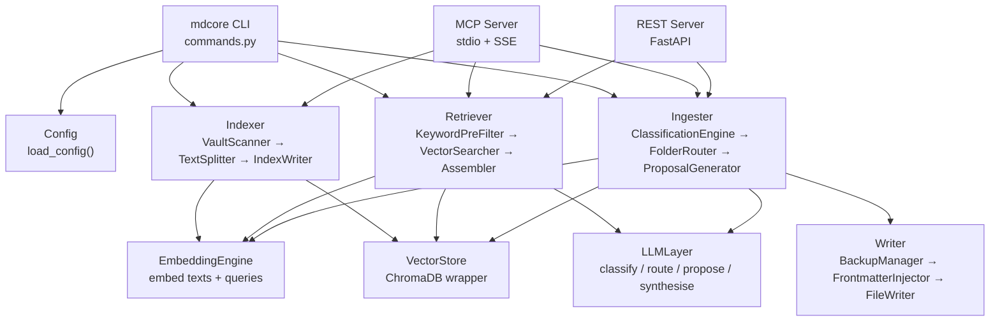

# ARCHITECTURE.md - mdcore (markdowncore-ai)

**Version:** 1.1.4  
**PyPI package:** `markdowncore-ai`  
**CLI entrypoint:** `mdcore`  
**Entry point declaration:** `pyproject.toml` line 100 - `mdcore = "mdcore.cli.commands:app"`

---

## 1. System Overview

mdcore is a local, LLM-agnostic CLI knowledge base engine for Markdown vaults. It provides:

- **Indexing** - scan vault files, chunk text, embed with configurable backends, persist to ChromaDB
- **Search** - vector similarity search with keyword pre-filtering, passage stitching, optional LLM synthesis
- **Ingestion** - classify incoming summaries, detect conflicts, route to folders, propose edits, write atomically
- **Serve modes** - REST API (FastAPI), MCP stdio, MCP SSE/HTTP

All LLM calls go through `LLMLayer` in `mdcore/llm/llm_layer.py`, which wraps LangChain chat models. Embeddings go through `EmbeddingEngine` in `mdcore/core/indexer/embedding_engine.py`, which wraps LangChain embedding models with a local pickle cache.

**Quick start (local Ollama):**
```bash
uv tool install markdowncore-ai          # install
ollama pull qwen3.5:4b                   # primary model
ollama pull phi4-mini                    # synthesis model
ollama pull nomic-embed-text             # embedding model
mdcore init                              # interactive config wizard
mdcore index                             # index your vault
mdcore search "topic"                    # search
```
See [BACKENDS.md](BACKENDS.md) for all backend options (OpenAI, Anthropic, Gemini, aggregator).

**What mdcore does NOT do:**
- No always-on background server or daemon
- No automatic writes without user approval
- No cloud sync or remote storage
- No internet access (all processing is local unless using an API backend)



---

## 2. The Two Flows

### Flow A: `mdcore search`

```mermaid
flowchart TD
    A["_load(config, models)\nload_config() → MdCoreConfig"] --> B
    B["VectorStore(cfg.vector_store)\nopen ChromaDB PersistentClient"] --> C
    C["EmbeddingEngine(cfg.embeddings)\nbuild embedding model + load pickle cache"] --> D
    D["store.all_metadata()\nChromaDB READ: all chunk metadata"] --> E

    E{keyword_prefilter\nenabled?}
    E -- yes --> F["KeywordPreFilter.filter(topic, all_chunks) [mode=hybrid]\nBM25 (rank_bm25) over chunk content, top-50 by score\n+ term-presence match on filename + folder_path (min_score=0.3)\nStrips owner_name words; excludes other-person folders\nReturns set[str] of candidate source_files"]
    E -- no --> G
    F --> G

    G["Strip owner_name words from vector_query\nthey don't appear in file content"] --> H

    H["VectorSearcher.search(query, candidate_sources)\nPhase 1: embed_query → store.search(k=top_k*2 if candidates else top_k)\n  → filter to candidates → trim to top_k → filter by similarity_threshold=0.65\nPhase 2 rescue: for candidate files with zero Phase 1 chunks,\n  store.search_in_sources() at similarity_threshold*0.75 (relaxed/lower, 0.65→~0.49)"] --> I

    I["group_by_source(chunks)\ndict[source_file, list[Document]] sorted by chunk_index"] --> J

    J["stitch(sf, chunks, cfg.retriever) per source\ngap tolerance: stitch_distance=2 chunk_index units\ntruncate at stitch_max_words=400"] --> K

    K["rank_sources(passages_by_source)\nsort by mean avg_similarity descending"] --> L

    L["assemble(topic, ranked, cfg.retriever)\napply context_block_max_words=1000 budget\nbuild primary + signpost lists"] --> M

    M{--raw flag?}
    M -- yes --> N["format_context(ctx, cfg)\nwrite markdown to output file\nDONE - no LLM call"]
    M -- no --> O

    O["raw_text_for_synthesis(ctx)\nnumbered [N] blocks, cap at 4000 chars"] --> P

    P["LLMLayer.synthesise(topic, raw_text)\nPriority: synthesise_backend+model → same backend+synthesise_model → primary\nOllama: think=False, temperature=0\nCalls _strip_hallucinated_citations() on response"] --> Q

    Q["Write output to\n<vault>/mdcore-output/YYYY-MM-DD-slug.md\nSlug: lowercase, hyphens, max 60 chars"]
```



**Output file format:**
```
# {topic}
*{timestamp} · {sources} · {mode}*
[disclaimer]
## Sources
[list]
---
## Briefing
{synthesis}
---
## Raw Excerpts
{format_context output}
```

---

### Flow B: `mdcore ingest`

```mermaid
flowchart TD
    A["_load(config, models)\nMdCoreConfig"] --> B

    B["SummaryReceiver.receive_from_file(path) or stdin\n_validate():\n  word_count < 100 → ValueError\n  heading_count < 1 → ValueError"] --> C

    C["SummaryEmbedder.embed(summary)\nembed_query(summary) → full embedding\nembed_texts(sentences) → per-sentence embeddings"] --> D

    D["ClassificationEngine.classify(embs.full, summary)\nstore.file_embeddings() → ChromaDB READ all chunk embeddings\nCompute mean embedding per file\nCosine sim between summary_embedding and each file mean\nKeep top-10 scores"] --> E

    E{Three-zone\nclassification}

    E -- "top_score > 0.82\nAND NOT _is_self_contained()" --> F["Zone 1: auto-UPDATE\ntarget = highest-scoring file"]
    E -- "0.65 <= top_score <= 0.82\nOR _is_self_contained() blocks auto-UPDATE" --> G["Zone 2: LLM CALL\nllm.classify(summary_text, candidates)\ncandidates = top 3 files\nNOTE: page_content = source_file string only, not actual content"]
    E -- "top_score < 0.65" --> H["Zone 3: auto-NEW\nno existing file matches"]

    F --> I

    G --> I

    H --> J

    I["Display decision: action=update, target_file, confidence, reasoning, used_llm"] --> K

    K["ConflictDetector (if conflict_detection=True)\nSplit both texts into 5+ word sentences\nEmbed all sentences\nFind pairs with 0.88 <= sim <= 0.97 → ConflictPair list capped at 10\nConflict is FLAG ONLY - does not block write"] --> L

    J["FolderRouter.route(summary, top_scores)\nStage 1: if max_sim >= 0.60\n  extract candidate folders from top-k file paths\n  add vault-map-described folders\n  else: use full folder list\nStage 2: LLM CALL → llm.route_folder()\n  if LLM returns invalid folder: LLM CALL again with full list\n  if confidence < 0.75: user prompted to confirm"] --> L

    L["ProposalGenerator.generate()\nLLM CALL → llm.propose(clf_result, existing_content[:600], incoming_summary[:800])\nReturns 2-4 bullet points as plain text"] --> M

    M["Display proposal + conflicts to user\n[A]pprove / [E]dit / [R]eject"] --> N

    N{User choice}
    N -- Approve --> O
    N -- Edit --> P["User edits in $EDITOR"] --> O
    N -- Reject --> Q["Exit without writing"]

    O["_execute_write()\n1. BackupManager.backup(target)\n   copy to ~/.mdcore/backups/{filename}.{timestamp}.bak\n   rotate > 5 backups per file\n2. FrontmatterInjector.inject(target, fm_updates)\n   merge tags, related, updated\n3. FileWriter.update() OR FileWriter.create()\n   atomic write\n4. IndexTrigger.reindex(path)\n   DocumentLoader.load + TextSplitter.split\n   + IndexWriter.write + ManifestManager.update\n   for THE SINGLE WRITTEN FILE ONLY"]
```



**Three-zone classification detail:**

```
_is_self_contained() heuristic:
  h2_count   = regex ^#{1,2}\s+\S   (matches H1 AND H2 - regex says #{1,2})
  has_table  = regex ^\|.+\|
  list_items = regex ^[\*\-\d]+[\.\)]\s+\S
  Returns True if h2_count >= 2 AND (has_table OR len(list_items) >= 3)

Zone 1 (auto-UPDATE):  top_score > 0.82 AND _is_self_contained() is False
Zone 2 (LLM classify): 0.65 <= top_score <= 0.82
                        -OR- top_score > 0.82 AND _is_self_contained() is True
Zone 3 (auto-NEW):     top_score < 0.65
```

---

## 3. Package Structure

```
mdcore/
├── __init__.py                       empty
├── cli/
│   └── commands.py                   all Typer commands + _load() + helper functions
├── config/
│   ├── loader.py                     load_config(), expand_path(), DEFAULT_CONFIG_PATH
│   └── models.py                     all Pydantic config models
├── core/
│   ├── deps.py                       backend dep checking + install helpers
│   ├── vault_map.py                  VaultMap: manages <vault>/.mdcore-meta.yaml
│   ├── indexer/
│   │   ├── document_loader.py        DocumentLoader: loads .md files
│   │   ├── embedding_engine.py       EmbeddingEngine: embeds text, manages pickle cache
│   │   ├── index_writer.py           IndexWriter: writes chunks to ChromaDB + triggers delete
│   │   ├── manifest_manager.py       ManifestManager: manifest.json read/write/diff
│   │   ├── multimodal_loader.py      MultiModalLoader: loads PDF/DOCX/TXT
│   │   ├── text_splitter.py          TextSplitter: heading-aware chunking
│   │   └── vault_scanner.py          VaultScanner: walks vault, filters eligible files
│   ├── retriever/
│   │   ├── chunk_grouper.py          group_by_source(): groups chunks by file
│   │   ├── chunk_stitcher.py         stitch(): joins adjacent chunks into passages
│   │   ├── context_assembler.py      assemble(): applies word budget, builds AssembledContext
│   │   ├── context_formatter.py      format_context(), raw_text_for_synthesis()
│   │   ├── keyword_prefilter.py      KeywordPreFilter: BM25 over content + path (hybrid), persona detection
│   │   ├── source_ranker.py          rank_sources(): sort by avg similarity
│   │   └── vector_searcher.py        VectorSearcher: two-phase vector search
│   ├── ingester/
│   │   ├── classification_engine.py  ClassificationEngine: three-zone classify logic
│   │   ├── conflict_detector.py      ConflictDetector: sentence-level similarity pairs
│   │   ├── folder_router.py          FolderRouter: two-stage semantic pre-filter + LLM pick
│   │   ├── proposal_generator.py     ProposalGenerator: calls LLM.propose()
│   │   ├── summary_embedder.py       SummaryEmbedder: embed full + sentences
│   │   └── summary_receiver.py       SummaryReceiver: validate word count + heading count
│   └── writer/
│       ├── backup_manager.py         BackupManager: copy before write, rotate old backups
│       ├── file_writer.py            FileWriter: atomic update + create
│       ├── frontmatter_injector.py   FrontmatterInjector: merge YAML frontmatter
│       └── index_trigger.py          IndexTrigger: single-file reindex after write
├── llm/
│   └── llm_layer.py                  LLMLayer: classify, propose, synthesise, route_folder
├── store/
│   └── vector_store.py               VectorStore: ChromaDB wrapper
├── mcp_server/
│   └── server.py                     MCP stdio server + SSE server (run_sse)
├── serve/
│   ├── server.py                     FastAPI REST server
│   ├── chain.py                      LangChain Runnables: build_search_chain, build_ingest_chain
│   └── models.py                     Pydantic request/response models for REST API
├── gui/
│   └── app.py                        Textual TUI (experimental)
├── utils/
│   ├── file_utils.py                 atomic_write, word_count, vault_relative_path, folder_path_from_relative
│   └── logging.py                    get_logger(), rotating file handler
└── docs/                             embedded markdown docs served by `mdcore docs`

scripts/
├── eval_questions.yaml               eval question set
└── langsmith_eval.py                 LangSmith eval script

tests/                                pytest tests
```

---

## 4. LLM Backend Architecture

### LLMLayer (`mdcore/llm/llm_layer.py`)

`LLMLayer` is the single gateway for all LLM calls. It lazy-initializes the primary LLM on first `_invoke()` call.

**`_invoke()` logic:**
1. Lazy-initialize `self._llm` on first call
2. Call `self._get_llm().invoke(prompt)`
3. If `response.content` is empty: raise `RuntimeError` (NOT silently continue)
4. If any exception from primary: log warning, try `self._get_fallback()`
5. If fallback also fails (or not configured): raise `RuntimeError`

**Four LLM call sites:**

| Method | Called from | Condition |
|--------|-------------|-----------|
| `LLMLayer.classify()` | `ClassificationEngine.classify()` | `0.65 <= similarity <= 0.82` |
| `LLMLayer.route_folder()` | `FolderRouter.route()` | Always during ingest when `action=new`; possibly called twice if first result is invalid folder |
| `LLMLayer.synthesise()` | `search()` command | `--raw` flag NOT passed |
| `LLMLayer.propose()` | `ProposalGenerator.generate()` | Always during ingest after classification |

**Synthesis backend priority:**
1. `synthesise_backend` + `synthesise_model` (dedicated synthesis LLM)
2. Same backend + `synthesise_model`
3. Primary `backend` + `model`

Ollama synthesis: always `think=False`, `temperature=0`.

### LLM Backends

| Backend | LangChain class | Package | api_key required | Extra |
|---------|----------------|---------|-----------------|-------|
| `ollama` | `ChatOllama` | `langchain_ollama` | No | core dep |
| `openai` | `ChatOpenAI` | `langchain_openai` | Yes | `openai` extra |
| `anthropic` | `ChatAnthropic` | `langchain_anthropic` | Yes | `anthropic` extra |
| `gemini` | `ChatGoogleGenerativeAI` | `langchain_google_genai` | Yes (google_api_key) | core dep (moved from extra in 1.3.3) |
| `aggregator` | `AggregatorChat` | `llm_keypool` | No (managed by llm-keypool CLI) | `aggregator` extra |
| `huggingface` | NOT IMPLEMENTED | - | - | DEAD: always raises `ValueError` |

**KNOWN ISSUE:** `huggingface` is listed in the `_LLMBackend` Literal and can be set in config, but `_build_llm()` has no case for it. Any use raises `ValueError("Unknown LLM backend: huggingface")`. See [Section 9](#9-known-issues-and-technical-debt).

### Embedding Backends

| Backend | LangChain class | Model config field | Extra |
|---------|----------------|-------------------|-------|
| `ollama` | `OllamaEmbeddings` | `local_model` | core dep |
| `huggingface` | `HuggingFaceEmbeddings` | `local_model` | `huggingface` extra |
| `openai` | `OpenAIEmbeddings` | `api_model` | `openai` extra |
| `gemini` | `GoogleGenerativeAIEmbeddings` | `api_model` | core dep |
| `aggregator` | NOT SUPPORTED | - | Raises `ValueError` - cannot swap embeddings mid-index |

### Token Logging (`_log_tokens()`)

Normalized across backends at `INFO` level (or `DEBUG` if unavailable):

| Backend | prompt field | completion field |
|---------|-------------|-----------------|
| Gemini | `response_metadata.usage_metadata.prompt_token_count` | `candidates_token_count` |
| OpenAI | `response_metadata.token_usage.prompt_tokens` | `completion_tokens` |
| Anthropic | `response_metadata.usage.input_tokens` | `output_tokens` |
| Ollama | `response_metadata.prompt_eval_count` | `eval_count` |
| llm-keypool | `response_metadata.tokens_used` (combined only) | - |

### LangSmith Wiring

In `LLMLayer.__init__()`, if `cfg.langsmith_api_key` is set:
```python
os.environ["LANGCHAIN_TRACING_V2"] = "true"
os.environ["LANGCHAIN_API_KEY"] = cfg.langsmith_api_key
os.environ["LANGCHAIN_PROJECT"] = cfg.langsmith_project or "mdcore"
```
LangChain picks these up automatically for all subsequent LLM calls.

---

## 5. Data Model

### ChromaDB (`VectorStore`)

- **Client:** `chromadb.PersistentClient` with `anonymized_telemetry=False`
- **Collection:** `cfg.collection_name` (default `"mdcore_vault"`), metadata `{"hnsw:space": cfg.distance_metric}`
- **Distance metric default:** `"cosine"` - ChromaDB cosine returns distance (0=identical), converted: `similarity = 1.0 - dist`
- **Chunk ID format:** `"{source_file}::chunk::{chunk_index}"`
- **Upsert fields:** `ids`, `documents`, `embeddings`, `metadatas`
- **Search returns:** `documents`, `metadatas`, `distances` - adds `_similarity` to metadata
- **Delete by source_file:** `get(where={"source_file": sf})` then `delete(ids=...)`
- **`search_in_sources`:** uses `$in` filter on `source_file`

### Embed Cache

- **Format:** `dict[sha256_hex, list[float]]` serialized with `pickle`
- **Key:** SHA-256 of the (possibly truncated) text string
- **Path:** `cfg.embeddings.cache_path / "embed_cache.pkl"` (default `~/.mdcore/embed_cache/embed_cache.pkl`)
- **Lifecycle:** Loaded at `EmbeddingEngine.__init__()`, saved after every batch of new embeddings
- **Invalidation:** None automatic. Stale if embedding model changes. Fix: `mdcore index --force` (deletes `embed_cache.pkl`)
- **Max embed chars:** 6000 (nomic-embed-text 8192 token limit, code tokenizes at ~2.5-3 chars/token)
- **Query embeddings:** NOT cached (`embed_query` bypasses cache)
- **Security note:** `pickle` is not safe for untrusted sources. Corrupt cache is silently treated as empty dict via `try/except` on load.

### Manifest

- **Format:** JSON `dict[str, float]` - `{"relative/path/to/file.md": 1234567890.123}` (string path → float mtime)
- **Path:** `cfg.manifest.path` (default `~/.mdcore/manifest.json`, resolved relative to vault root if not absolute)
- **"Dirty" definition:** key not in manifest OR `manifest_mtime < file_stat().st_mtime`
- **Key format:** vault-relative paths (e.g., `"Career/resume.md"`)
- **Save timing:** After every individual file update/remove - not batched

### Vault Map

- **File:** `<vault>/.mdcore-meta.yaml` (always excluded from indexing by filename check in VaultScanner)
- **Format:** YAML with `folders:` key; sub-keys are vault-relative folder paths; values are description strings
- **Generated by:** `mdcore map` - writes template with all current folders, preserves existing descriptions
- **Consumed by:** `FolderRouter` via `VaultMap.folder_descriptions()`
- **`mdcore map --repair`:** calls `stale_descriptions()` + `remove_description()` for each stale folder, then `save()`

### Backups

- **Location:** `~/.mdcore/backups/{filename}.{timestamp}.bak`
- **Rotation:** max 5 backups per file (`BackupConfig.max_backups_per_file`)

---

## 6. Configuration Layering

Config is loaded **per-command** (not at app startup) via `_load()` in `commands.py`.

```
1. config.yaml        (--config flag or ~/.mdcore/config.yaml)
2. models.yaml        (--models flag or ~/.mdcore/models.yaml)
                      merged on top, ONLY overrides `llm` and `embeddings` sections
```

Post-load resolution:
- Relative `persist_path` resolved against vault root
- Relative `manifest.path` resolved against vault root

Keys that **cannot** be overridden by `models.yaml`: everything except `llm` and `embeddings` sections.

### All Pydantic Config Models (`mdcore/config/models.py`)

#### `VaultConfig`
| Field | Type | Default | Notes |
|-------|------|---------|-------|
| `path` | `str` | required | vault directory path |
| `owner_name` | `str` | `""` | persona routing in prefilter |
| `excluded_folders` | `list[str]` | `["noise"]` | case-insensitive match against path parts; `"mdcore-output"` always excluded by VaultScanner |
| `excluded_extensions` | `list[str]` | `[".canvas"]` | exact lowercase suffix match |
| `index_pdf` | `bool` | `False` | enables `.pdf` in VaultScanner + MultiModalLoader |
| `index_docx` | `bool` | `False` | enables `.docx` |
| `index_txt` | `bool` | `False` | enables `.txt` |

#### `IndexerConfig`
| Field | Type | Default | Notes |
|-------|------|---------|-------|
| `min_word_count` | `int` | `50` | skip files + chunks below this |
| `min_structure_signals` | `int` | `1` | `heading_open + paragraph_open + bullet_list_open` token count |
| `skip_structure_check_for` | `list[str]` | `[".pdf",".docx",".txt"]` | bypass structure check |
| `manifest_path` | `str` | `"~/.mdcore/manifest.json"` | DEAD FIELD - never read; actual path from `ManifestConfig.path` |
| `chunk_size` | `int` | `512` | word count for oversized chunk splitting |
| `chunk_overlap` | `int` | `64` | word overlap in `_split_by_tokens` |
| `max_chunk_words` | `int` | `400` | threshold to trigger `_split_by_tokens` |
| `heading_aware_splitting` | `bool` | `True` | split on H2/H3 boundaries |
| `preserve_tables` | `bool` | `True` | don't split chunks containing markdown tables |
| `preserve_code_blocks` | `bool` | `True` | don't split chunks containing fenced code |
| `heading_levels` | `list[int]` | `[2, 3]` | which heading levels trigger splits |
| `batch_size` | `int` | `32` | `embed_texts` batch size |
| `metadata_fields` | `list[str]` | `[...]` | informational only, not enforced by indexer |

#### `EmbeddingsConfig`
| Field | Type | Default | Notes |
|-------|------|---------|-------|
| `backend` | `Literal[...]` | `"ollama"` | ollama, huggingface, openai, gemini |
| `local_model` | `str` | `"nomic-embed-text"` | ollama and huggingface backends |
| `api_model` | `str` | `"text-embedding-3-small"` | openai and gemini backends |
| `api_key` | `Optional[str]` | `None` | |
| `cache_embeddings` | `bool` | `True` | |
| `cache_path` | `str` | `"~/.mdcore/embed_cache"` | |

#### `VectorStoreConfig`
| Field | Type | Default | Notes |
|-------|------|---------|-------|
| `backend` | `Literal["chroma"]` | `"chroma"` | only chroma supported |
| `persist_path` | `str` | `"~/.mdcore/chroma_db"` | |
| `collection_name` | `str` | `"mdcore_vault"` | |
| `distance_metric` | `Literal[...]` | `"cosine"` | cosine, l2, ip |

#### `RetrieverConfig`
| Field | Type | Default | Notes |
|-------|------|---------|-------|
| `keyword_prefilter` | `bool` | `True` | |
| `keyword_prefilter_min_score` | `float` | `0.3` | |
| `top_k` | `int` | `15` | |
| `similarity_threshold` | `float` | `0.65` | |
| `context_block_max_words` | `int` | `1000` | |
| `max_chunks_per_source` | `int` | `2` | |
| `stitch_distance` | `int` | `2` | gap tolerance in chunk_index units |
| `stitch_max_words` | `int` | `400` | max words per stitched passage before truncation |
| `signpost_max_items` | `int` | `8` | |
| `signpost_include_section_hints` | `bool` | `True` | UNCLEAR: set in config but not read in `context_formatter.py` |
| `output_format` | `Literal[...]` | `"markdown"` | UNCLEAR: not read anywhere in `context_formatter.py` |
| `include_word_count` | `bool` | `True` | |
| `include_timestamp` | `bool` | `True` | |
| `include_source_paths` | `bool` | `True` | |
| `include_similarity_scores` | `bool` | `False` | UNCLEAR: not used in `format_context` |

#### `IngesterConfig`
| Field | Type | Default | Notes |
|-------|------|---------|-------|
| `min_summary_word_count` | `int` | `100` | |
| `min_summary_headings` | `int` | `1` | |
| `similarity_threshold_high` | `float` | `0.82` | Zone 1/2 boundary |
| `similarity_threshold_low` | `float` | `0.65` | Zone 2/3 boundary |
| `max_candidates_for_llm` | `int` | `3` | |
| `conflict_detection` | `bool` | `True` | |
| `conflict_similarity_min` | `float` | `0.88` | |
| `conflict_similarity_max` | `float` | `0.97` | |
| `folder_routing_confidence` | `float` | `0.75` | below this: user prompted to confirm |

#### `FrontmatterConfig`
| Field | Type | Default | Notes |
|-------|------|---------|-------|
| `inject` | `bool` | `True` | UNCLEAR: not read in `FrontmatterInjector` - it always injects based on `fields` list |
| `fields` | `list[str]` | `["tags","updated","related"]` | |
| `tag_max_count` | `int` | `8` | |
| `related_max_count` | `int` | `5` | |

#### `BackupConfig`
| Field | Type | Default | Notes |
|-------|------|---------|-------|
| `enabled` | `bool` | `True` | |
| `backup_path` | `str` | `"~/.mdcore/backups"` | |
| `max_backups_per_file` | `int` | `5` | |

#### `WriterConfig`
| Field | Type | Default | Notes |
|-------|------|---------|-------|
| `require_approval` | `bool` | `True` | UNCLEAR: not read in `_execute_write()`; approval is always requested in `ingest()` regardless |
| `append_position` | `Literal[...]` | `"end"` | end, after_last_heading |
| `frontmatter` | `FrontmatterConfig` | | |
| `backup` | `BackupConfig` | | |

#### `LLMConfig`
| Field | Type | Default | Notes |
|-------|------|---------|-------|
| `backend` | `Literal[...]` | `"ollama"` | ollama, openai, anthropic, gemini, huggingface, aggregator |
| `model` | `str` | `"qwen3.5:4b"` | |
| `api_key` | `Optional[str]` | `None` | |
| `temperature` | `float` | `0.2` | |
| `think` | `bool` | `False` | passed as `think=` to ChatOllama; other backends ignore it |
| `max_tokens` | `int` | `1000` | |
| `timeout_seconds` | `int` | `30` | |
| `fallback_backend` | `Optional[str]` | `None` | |
| `fallback_model` | `Optional[str]` | `None` | |
| `fallback_api_key` | `Optional[str]` | `None` | |
| `aggregator_category` | `Optional[str]` | `None` | |
| `aggregator_rotate_every` | `int` | `5` | |
| `synthesise_backend` | `Optional[str]` | `None` | |
| `synthesise_model` | `Optional[str]` | `None` | |
| `synthesise_api_key` | `Optional[str]` | `None` | |
| `langsmith_api_key` | `Optional[str]` | `None` | |
| `langsmith_project` | `Optional[str]` | `None` | |

#### `ManifestConfig`
| Field | Type | Default | Notes |
|-------|------|---------|-------|
| `path` | `str` | `"~/.mdcore/manifest.json"` | |
| `drift_warning_threshold` | `int` | `3` | number of changed files to trigger drift warning in `status` |
| `drift_warning_age_hours` | `int` | `24` | UNCLEAR: set in model but never read anywhere |

#### `CLIConfig`
| Field | Type | Default | Notes |
|-------|------|---------|-------|
| `theme` | `Literal["dark","light"]` | `"dark"` | UNCLEAR: set in config, Rich console is created without theme parameter |
| `confirm_before_index` | `bool` | `True` | if False: skips [A]ll/[C]ancel prompt in `index` |
| `show_similarity_scores` | `bool` | `False` | UNCLEAR: not read in any output code |
| `verbose` | `bool` | `False` | UNCLEAR: `verbose` is a per-command CLI flag, not read from config |

#### `LoggingConfig`
| Field | Type | Default | Notes |
|-------|------|---------|-------|
| `enabled` | `bool` | `True` | UNCLEAR: logging is always set up via `setup_logging()` regardless |
| `log_path` | `str` | `"~/.mdcore/logs"` | |
| `log_level` | `Literal[...]` | `"INFO"` | DEBUG, INFO, WARNING, ERROR |
| `max_log_size_mb` | `int` | `10` | |
| `max_log_files` | `int` | `5` | |

---

## 7. CLI Architecture

The Typer `app` instance is created at module level in `mdcore/cli/commands.py`. Config is NOT loaded at app startup - each command calls `_load()` independently.

**Reusable option definitions:**
- `_cfg_option` - `--config` path option
- `_models_option` - `--models` path option

**`_load(config, models)`:** calls `load_config()` then `setup_logging()`.

### Commands

| Function name | CLI name | Config required | Description |
|--------------|----------|----------------|-------------|
| `init()` | `init` | No | setup wizard |
| `index()` | `index` | Yes | full vault indexing. `--force` wipes manifest.json, chroma_db/, embed_cache.pkl then falls through to normal index |
| `search()` | `search` | Yes | vector search + optional LLM synthesis |
| `ingest()` | `ingest` | Yes | classify + route + propose + write |
| `vault_map_cmd()` | `map` | Yes | manage `.mdcore-meta.yaml` |
| `status()` | `status` | Yes | VaultScanner + ManifestManager + VectorStore.all_metadata() |
| `eval()` | `eval` | Yes | retriever pipeline only, NO LLM call |
| `deps()` | `deps` | No | `required_backends()` + `install_packages()` |
| `docs()` | `docs` | No | reads embedded markdown from `mdcore.docs` package |
| `config_cmd()` | `config` | No | `load_config()` or editor open |
| `gui()` | `gui` | No | `mdcore.gui.app.run` (experimental Textual TUI) |
| `serve()` | `serve` | Yes | uvicorn on `mdcore.serve.server:app` |
| `mcp()` | `mcp` | Yes | `asyncio.run(mdcore.mcp_server.server.main())` - stdio transport |
| `mcp_serve()` | `mcp-serve` | Yes | `mdcore.mcp_server.server.run_sse()` - SSE/HTTP on `http://127.0.0.1:8766/sse` |

### MCP Tools (4 tools)

| Tool | Description |
|------|-------------|
| `search_vault(query)` | runs `build_search_chain`, returns synthesised answer + sources |
| `ingest_note(content, title)` | runs `build_ingest_chain`, returns proposal (no write) |
| `vault_status()` | reads `VectorStore.all_metadata()`, returns chunk count + file types |
| `index_vault(dry_run=True)` | `dry_run=True`: scan + diff + return counts; `dry_run=False`: actually indexes |

**MCP stdio** (`mdcore mcp`): for Claude Desktop config. No stdout output during operation (would corrupt protocol).  
**MCP SSE/HTTP** (`mdcore mcp-serve`): binds on `http://127.0.0.1:8766/sse`. For Hermes and other URL-based clients.

### REST API (`mdcore serve`)

| Route | Method | Description |
|-------|--------|-------------|
| `/ask` | POST | search + synthesise |
| `/propose` | POST | classify + propose (no write) |
| `/health` | GET | index stats |
| `/search/invoke` | POST | LangServe route (if langserve installed) |
| `/ingest-propose/invoke` | POST | LangServe route (if langserve installed) |

---

## 8. Indexing Pipeline

### VaultScanner.scan()

```
rglob("*") over vault_path
Accept: .md always; .pdf/.docx/.txt only if enabled in VaultConfig
Skip: .mdcore-meta.yaml by filename
Skip: if suffix in excluded_extensions (case-sensitive lowercase)
Skip: if any path part (lowercased) in excluded_folders (always includes "mdcore-output")
Skip: if word count < min_word_count (50)
For .md: parse with markdown-it-py, count heading_open + paragraph_open + bullet_list_open
  Skip if count < min_structure_signals (1)
For .pdf/.docx/.txt: bypass structure check (in skip_structure_check_for)
```

### TextSplitter.split()

```
IF heading_aware_splitting=True:
  Pattern: ^(#{2,3})\s+(.+)$  (respects heading_levels=[2,3])
  Maintains heading_stack for breadcrumb: "H2 Title > H3 Title"
  Each section: (breadcrumb, text) tuple

For each section:
  if wc < min_word_count AND prior chunks exist: append to previous chunk
  if wc > max_chunk_words (400): _split_by_tokens()
    if preserve_tables=True AND table found: return whole text as one chunk
    if preserve_code_blocks=True AND code block found: return whole text as one chunk
    else: word-based split with chunk_size=512 words, chunk_overlap=64 words
    NOTE: chunk_size is treated as WORD COUNT
          (comment in code: "treat chunk_size as word count for simplicity")

Metadata per chunk: source doc metadata + heading_breadcrumb, chunk_index, chunk_total,
                    word_count, is_table, is_code, last_indexed
```

### IndexWriter.write()

```
1. Delete all existing chunks for source_file from ChromaDB
2. Sanitize metadata: strip non-primitive types (nested dicts/lists not supported by ChromaDB)
3. Batch embed texts in batches of batch_size=32 via EmbeddingEngine
4. Upsert all chunks + embeddings to ChromaDB
```

### `mdcore index --force` wipes EXACTLY:

- `manifest_path` (single file unlink)
- `chroma_path` (shutil.rmtree)
- `embed_cache.pkl` (single file unlink)
- Does NOT touch any vault files

### Two-Phase Vector Search

```
Phase 1:
  engine.embed_query(query)
  store.search(emb, k=top_k*2 if candidates else top_k)
  filter to candidate_sources (from KeywordPreFilter)
  trim to top_k
  filter by similarity_threshold=0.65

Phase 2 (rescue):
  for any candidate_source files with ZERO chunks in Phase 1:
    store.search_in_sources() at relaxed threshold = similarity_threshold * 0.75
    (0.65 → ~0.49; bar LOWERED not raised, so near-miss chunks like 0.55 get rescued)
    (recovers files that were in keyword candidates but missed vector threshold)
```

---

## 9. Known Issues and Technical Debt

### Issue 1: `huggingface` LLM backend is dead code

`huggingface` is listed in `_LLMBackend` Literal and can be set in `LLMConfig.backend`, but `_build_llm()` has no case for it. Any use raises `ValueError("Unknown LLM backend: huggingface")`. The field is a silent trap.

**Fix:** Either implement `ChatHuggingFace` integration or remove `huggingface` from the `_LLMBackend` Literal and document that it is embedding-only.

### Issue 2: `IndexerConfig.manifest_path` is a dead field

`IndexerConfig.manifest_path` is defined with default `"~/.mdcore/manifest.json"` but is never read anywhere. The actual manifest path comes exclusively from `ManifestConfig.path`.

**Fix:** Remove the field from `IndexerConfig` or add a deprecation warning.

### Issue 3: `ClassificationDecision.top_scores` type annotation bug

`top_scores: dict[str, float] = None` - `None` is not a valid `dict`. Should be `Optional[dict[str, float]] = None`.

**Fix:** Change type annotation to `Optional[dict[str, float]] = None`.

### Issue 4: classify() LLM call receives file paths, not content

When `ClassificationEngine.classify()` calls the LLM (Zone 2), the `candidates` list is built as `Document(page_content=source_file_string, metadata={"source_file": sf})`. The LLM receives only file path strings as content, not actual document text or snippets. This significantly limits classification quality.

**Fix:** Retrieve actual content snippets from ChromaDB for the candidate files before passing to LLM.

### Issue 5: MCP server crashes on import if config missing

`mdcore/mcp_server/server.py` runs `_cfg = load_config(DEFAULT_CONFIG_PATH)` at module level (lines 18-20). If `~/.mdcore/config.yaml` does not exist, the MCP server crashes during import before any error handling can run.

**Fix:** Defer config loading to the first tool call, or wrap in try/except with a meaningful error message.

### Issue 6: REST server same module-level config load issue

`mdcore/serve/server.py` has the same pattern on lines 34-36. Same risk and fix as Issue 5.

### Issue 7: Dead config fields (defined but never read)

The following fields are defined in Pydantic models but not read in any application code:

| Field | Model | Impact |
|-------|-------|--------|
| `signpost_include_section_hints` | `RetrieverConfig` | No effect on output |
| `output_format` | `RetrieverConfig` | `context_formatter.py` ignores it |
| `include_similarity_scores` | `RetrieverConfig` | Not used in `format_context` |
| `require_approval` | `WriterConfig` | Approval is always requested in `ingest()` |
| `theme` | `CLIConfig` | Rich console created without theme parameter |
| `show_similarity_scores` | `CLIConfig` | Not read in any output code |
| `verbose` | `CLIConfig` | Per-command CLI flag, not read from config |
| `enabled` | `LoggingConfig` | `setup_logging()` always runs |
| `drift_warning_age_hours` | `ManifestConfig` | Set but never read |
| `inject` | `FrontmatterConfig` | `FrontmatterInjector` always injects |

### Issue 8: `embed_cache.pkl` uses pickle

Pickle deserialization is not safe for untrusted files. A corrupt or malicious `embed_cache.pkl` is silently treated as an empty dict via `try/except` on load, which masks corruption without warning.

**Fix:** Consider replacing pickle with JSON + base64 for embedding vectors, or add a checksum/signature to validate cache integrity.

### Issue 9: Conflict detection does not block writes

`ConflictDetector` finds sentence-level similarity pairs (0.88-0.97 cosine similarity) and displays them to the user, but the user can approve the write even with conflicts. This is by design but can lead to near-duplicate content in the vault.

**Historical note:** The conflict threshold was raised from 0.81-0.83 to 0.88-0.97 after too many false positives.

---

## 10. How to Make Specific Changes

### Add a new LLM backend

1. Add the backend name to `_LLMBackend` Literal in `mdcore/config/models.py`
2. Add a case in `LLMLayer._build_llm()` in `mdcore/llm/llm_layer.py`
3. Add the required package to `pyproject.toml` extras
4. Update `required_backends()` in `mdcore/core/deps.py` if needed
5. Add token logging normalization in `_log_tokens()` if the backend uses a different metadata structure

### Add a new embedding backend

1. Add to `EmbeddingsConfig.backend` Literal in `mdcore/config/models.py`
2. Add a case in `EmbeddingEngine.__init__()` in `mdcore/core/indexer/embedding_engine.py`
3. Add package to `pyproject.toml` extras
4. Note: changing embedding backends invalidates the existing ChromaDB collection and embed cache. Users must run `mdcore index --force`.

### Add a new CLI command

1. Define a new function decorated with `@app.command()` in `mdcore/cli/commands.py`
2. Call `_load(config, models)` at the start if config is needed
3. Use `_cfg_option` and `_models_option` for standard config flags

### Add a new MCP tool

1. Add a new `@mcp.tool()` decorated function in `mdcore/mcp_server/server.py`
2. Reuse existing retriever/ingester classes via the patterns in `mdcore/serve/chain.py`
3. Note the module-level config load issue (Issue 5) - tools currently depend on config loaded at import time

### Add a new REST endpoint

1. Add route in `mdcore/serve/server.py`
2. Add request/response Pydantic models in `mdcore/serve/models.py`
3. Reuse `build_search_chain` or `build_ingest_chain` from `mdcore/serve/chain.py` for consistency

### Change chunking behavior

All chunking logic is in `mdcore/core/indexer/text_splitter.py`. Configuration is via `IndexerConfig`:
- `heading_aware_splitting`, `heading_levels` - control section splitting
- `max_chunk_words`, `chunk_size`, `chunk_overlap` - control oversized chunk splitting
- `preserve_tables`, `preserve_code_blocks` - control split inhibition

After changing chunking config, run `mdcore index --force` to rebuild all chunks.

### Fix the classify() content bug (Issue 4)

In `ClassificationEngine.classify()`, when building `candidates` for the LLM call, replace:
```python
Document(page_content=sf, metadata={"source_file": sf})
```
with a ChromaDB query to retrieve actual chunk text for each candidate file, then pass the first chunk or a summary as `page_content`.

### Add a config field that actually works

1. Add field to the appropriate Pydantic model in `mdcore/config/models.py`
2. Access it via the config object passed to the relevant class constructor
3. Verify it is not joining the dead fields list in Issue 7 - add a test or grep to confirm it is actually read in application code

### Change the three-zone classification thresholds

Edit `IngesterConfig` in `mdcore/config/models.py`:
- `similarity_threshold_high` (default 0.82) - Zone 1/2 boundary
- `similarity_threshold_low` (default 0.65) - Zone 2/3 boundary

Users can also set these in their `config.yaml`. No code changes required for threshold tuning.

### Add a new file type to indexing

1. Add `index_<ext>: bool = False` to `VaultConfig` in `mdcore/config/models.py`
2. Add extension check in `VaultScanner.scan()` in `mdcore/core/indexer/vault_scanner.py`
3. Add loader support in `MultiModalLoader` in `mdcore/core/indexer/multimodal_loader.py`
4. Add extension to `IndexerConfig.skip_structure_check_for` default if structure check is not applicable
